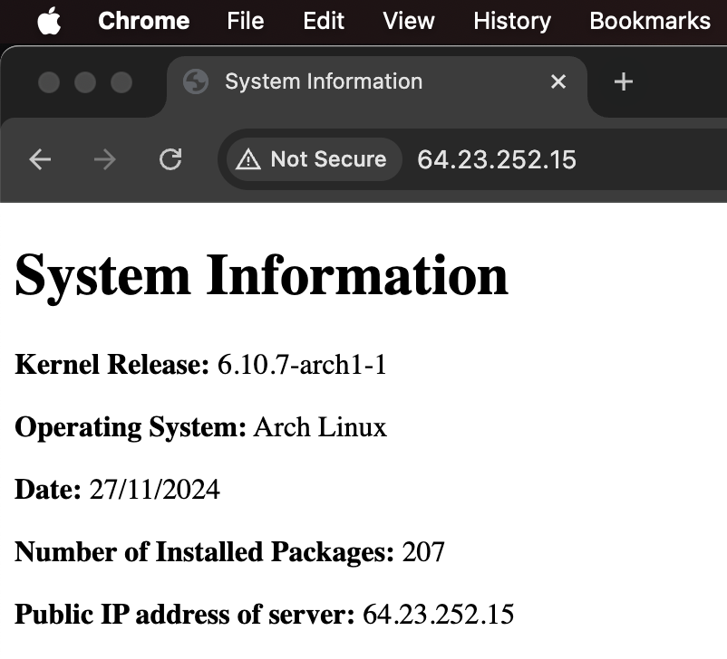

# Setting Up an Nginx Web Server on an Arch Linux Droplet

This guide will walk you through setting up an Nginx web server on an Arch Linux droplet. It's designed to be easy to follow, step by step.

### 1. Update Your System
```bash
sudo pacman -Syu
```

### 2. Clone the Repository
```bash
git clone https://github.com/inspiritilda/2420_linux_assignment_3-1.git
```

### 3. `cd` into the cloned directory
```bash
cd 2420_linux_assignment_3-1
```

### 4. Create the `webgen` user
```bash
sudo useradd --system -d /var/lib/webgen -s /usr/bin/nologin -m webgen
```

### 5. Create the required directory structure
```bash
sudo mkdir /var/lib/webgen/bin
sudo mkdir /var/lib/webgen/HTML
```

### 6. Copy the `generate-index` script
```bash
sudo cp bin/generate_index /var/lib/webgen/bin/
sudo chmod +x /var/lib/webgen/bin/generate-index
sudo chown webgen:webgen /var/lib/webgen/bin/generate-index
```

### 7. Copy timer and service files
```bash
sudo cp systemd/generate-index.service /etc/systemd/system/
sudo cp systemd/generate-index.timer /etc/systemd/system/
```

### 8. Reload `systemd` to register the files above
```bash
sudo systemctl daemon-reload
```

### 9. Copy the `nginx.conf` file
```bash
sudo cp nginx/nginx.conf /etc/nginx/nginx.conf
```

### 10. Set up Nginx server block
```bash
sudo mkdir -p /etc/nginx/sites-available
sudo mkdir -p /etc/nginx/sites-enabled
```

### 11. Copy the `serverblock.conf` file to `sites-available`
```bash
sudo cp nginx/serverblock.conf /etc/nginx/sites-available/
```
Then, create a symbolic link to `sites-enabled`
```bash
sudo ln -s /etc/nginx/sites-available/serverblock.conf /etc/nginx/sites-enabled/serverblock.conf
```

### 12. Test and reload Nginx
```bash
sudo nginx -t
sudo systemctl reload nginx
```

### 13. Enable UFW and configure Firewall rules
```bash
sudo systemctl enable --now ufw.service
```
To allow SSH and HTTP traffic,
```bash
sudo ufw allow ssh
sudo ufw allow http
sudo ufw limit ssh
sudo ufw enable
```

### 14. Start and Enable services
```bash
sudo systemctl start generate-index.service
sudo systemctl enable --now generate-index.timer
```

### 15. Verify your setup
Verify the setup by entering your droplet's IP address in the web browser.
